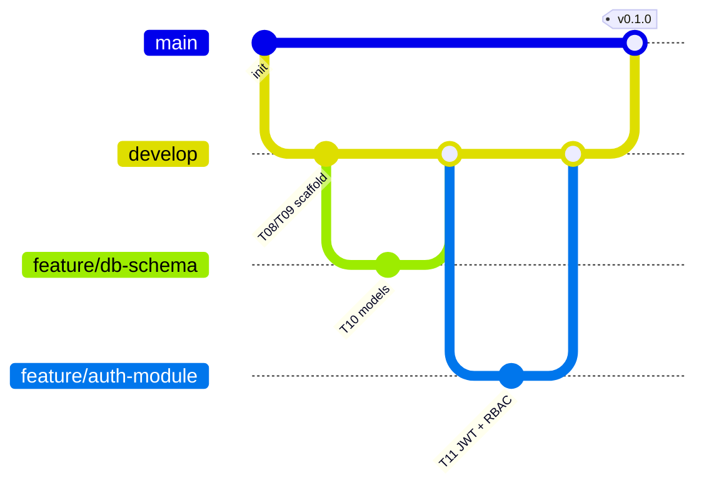

# Contributing — branching, PRs, and deployment

This covers the Gitflow workflow specified in the Task 1 documentation
(tech stack table, and Section 9.1.14 DevOps) and how it drives CI/CD.

## Branches

Two long-lived branches, created once; everything else is created ad hoc
and deleted after merging.

- **`main`** — production. Every commit here has been deployed to
  `silasmobiles.co.za`. Protected: no direct pushes, PRs only.
- **`develop`** — integration branch. Every commit here has been deployed
  to `staging.silasmobiles.co.za`. Protected: no direct pushes, PRs only.
- **`feature/<name>`** — one per unit of work (e.g. `feature/booking-quote-flow`),
  branched from `develop`, merged back into `develop` via PR.
- **`hotfix/<name>`** — urgent production fix, branched from `main`, merged
  into **both** `main` and `develop` via PR.
- **`release/<version>`** — optional; cut from `develop` when preparing a
  Task 2/3 milestone, for final QA before merging to `main`.



## Making a change

```bash
git checkout develop
git pull
git checkout -b feature/whatever-task-youre-on
# ... work, commit ...
git push -u origin feature/whatever-task-youre-on
# open a PR into develop
```

CI (`ci.yml`) runs lint + tests on every PR automatically, scoped to
whichever of `backend/` or `frontend/` actually changed. A PR needs a green
check and one approving review before it can merge — that's a **repo
setting**, not something the workflow file enforces by itself; set it up
once:

**Settings → Branches → Add branch protection rule**, for both `main` and
`develop`:
- Require a pull request before merging (1 approval)
- Require status checks to pass before merging → select `backend-ci` /
  `frontend-ci` (only appear in the list after the workflow has run once)
- Require branches to be up to date before merging

For `main` specifically, also set up **Settings → Environments → production
→ Required reviewers**, so `cd.yml`'s production deploy job pauses for a
manual approval even after the PR itself is merged — a second, deliberate
checkpoint before anything touches the live client-facing system.

## What merging actually triggers

| Merge target | CD result |
|---|---|
| `develop` | `cd.yml` deploys to **staging** automatically |
| `main` | `cd.yml` deploys to **production**, pausing for approval if you set up required reviewers above |

Commit messages: no enforced convention yet, but `type: short description`
(`feat: quote calculation`, `fix: booking status race condition`) reads well
in `git log` and costs nothing — worth adopting from the first commit
rather than retrofitting later.
