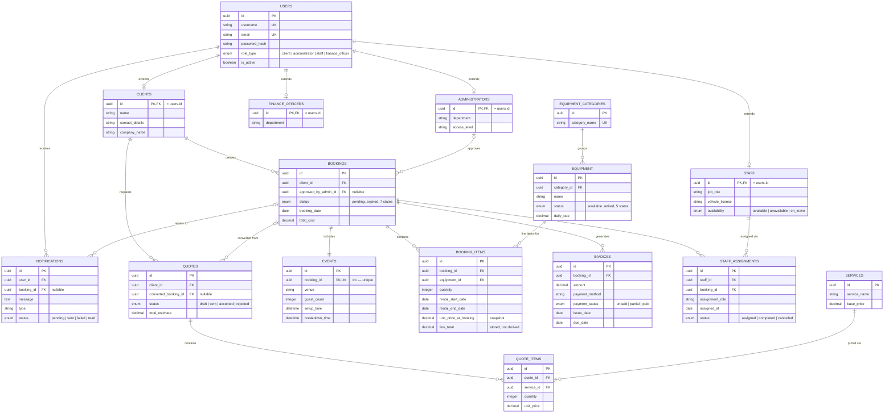

# Database Schema — Silas Mobiles Management System

The as-implemented ERD for the schema in `backend/src/migrations`, replacing
the placeholder under Task 1 §9.1.11 (which held class-diagram notation, not
a real ERD — flagged in the Task 1 → Task 2 handoff). Cardinality and every
relationship are explained below the diagram, not just shown, per the
Data Schema rubric criterion.

## Relationships, explained

**User → Client / Administrator / Staff / FinanceOfficer (1:0..1 each, shared primary key).**
`users` holds authentication data common to every role; `role_type` says
which one. Rather than one wide table with a nullable column per role (an
Administrator row permanently carrying null `job_role`/`vehicle_license`,
a Staff row permanently carrying null `department`/`access_level`), each
role gets its own table whose primary key **is** the `users.id` it
extends — class-table inheritance rather than single-table. A Client can
never exist without a User, so the foreign key is `ON DELETE CASCADE`:
delete the User, the Client row goes with it automatically.

**User → Notification (1:many).** Every notification has exactly one
recipient. `ON DELETE CASCADE` — a user's notification history has no
purpose once the user is gone.

**Client → Booking (1:many), Client → Quote (1:many).** A client can hold
several bookings and request several quotes over time; each belongs to
exactly one client. Both are `ON DELETE RESTRICT` — a client cannot be
deleted while they have booking or quote history, because that history is
financial record, not disposable data. POPIA's "right to erasure" is
handled by anonymising the Client/User row (blanking name, contact
details, email) rather than a hard delete that would also destroy invoices
and past transactions.

**Administrator → Booking (1:0..many, "approves").** A booking starts
`pending` with no admin attached; `approved_by_admin_id` is set once an
administrator approves it, and stays null for bookings still awaiting
review or rejected outright. `ON DELETE SET NULL` — if that administrator's
account is later removed, the booking survives; only the record of who
specifically approved it is lost, which is a minor audit gap, not a reason
to touch the booking.

**Booking → Event (1:1).** Every booking has exactly one event — enforced
with a `UNIQUE` constraint on `events.booking_id`, not just a foreign key,
which is what actually makes it 1:1 instead of 1:many. Composition
(`ON DELETE CASCADE`): an Event has no meaning without its Booking.

**Booking → BookingItem (1:many), Equipment → BookingItem (1:many).**
Resolves the Booking↔Equipment many-to-many: each line item names one
piece of equipment, a quantity, and a rental date range. `unit_price_at_booking`
and `line_total` are snapshotted at creation rather than looked up live
from `equipment.daily_rate`, so a later catalogue price change can never
silently alter the cost of an already-confirmed booking — directly the
Data Integrity NFR (Section 9.1.8). `booking_id` is `CASCADE` (a line item
means nothing without its booking); `equipment_id` is `RESTRICT` (a piece
of equipment can't be deleted while historical bookings still reference
it — that would corrupt financial history).

**Booking → Invoice (1:many).** A booking can accumulate more than one
invoice (a deposit and a balance, say); each invoice bills exactly one
booking. `ON DELETE RESTRICT`, deliberately the strictest relationship in
the schema — an invoice is a financial record, and deleting a booking
should never silently take an invoice down with it. Removing a booking
that has an invoice has to be an explicit, visible decision.

**Staff ↔ Booking (many:many, through StaffAssignment).** One of the two
gaps flagged in the Task 1 → Task 2 handoff: this relationship exists in
the Section 9.1.9 narrative and diagram description, but the class was
never in the actual diagram code. `staff_assignments` resolves it properly
— a surrogate-keyed table of its own, not a bare join table, because
"the staff member's specific role at a given event and the date of
assignment" (the narrative's own description) are real attributes of the
*assignment*, not just a link. A unique index on `(staff_id, booking_id)`
stops the same staff member being double-assigned to the same booking.

**EquipmentCategory → Equipment (1:many).** Every piece of equipment
belongs to exactly one category, for catalogue browsing and inventory
grouping. `ON DELETE RESTRICT` — a category can't be removed while
equipment is still filed under it.

**Client → Quote → QuoteItem → Service.** A client's quote is composed of
line items (`ON DELETE CASCADE` from Quote to QuoteItem — a line item is
meaningless without its quote), each referencing a service at a quantity
and price. `Quote.converted_booking_id` is a nullable, `SET NULL` link
recording which booking (if any) resulted from an accepted quote —
Quote.convertToBooking() in the Design Class Diagram. Most quotes never
convert; the ones that do shouldn't vanish if the resulting booking is
ever removed for some other reason.

## Deliberate departures from the Design Class Diagram

Everything above matches Section 9.1.9's Design Class Diagram and
narrative, with five exceptions — each made for a concrete reason, not a
convenience:

| Change | Why |
|---|---|
| `StaffAssignment` added as a real table | Named in the narrative, referenced in the ERD relationship list, but missing from the actual diagram code — one of the two gaps the handoff flagged. |
| `FinanceOfficer` added as a real table | Named in the domain narrative and the User Roles table (Section 9.1.6), but never modelled anywhere in the diagram — the second flagged gap. Kept minimal (mirrors Administrator's shape) since nothing more specific was ever specified. |
| `BookingItem.usageDate` → `rental_start_date` / `rental_end_date` + `line_total` | Found by actually running seed data through the schema, not by inspection: a single date can't price a multi-day rental, and Silas Mobiles' own Event model has separate setup/breakdown times — this is inherently a multi-day-rental business. |
| `Equipment.status` + `Equipment.availability` → one `status` ENUM | The diagram carried two overlapping, undefined String fields; the Equipment Status Lifecycle state diagram (Section 9.1.10) names the actual states this needs (`available`, `reserved`, `active_deployment`, `maintenance`, `retired`) — implemented as the one ENUM that diagram actually describes. |
| `Staff.role` → `job_role` | The diagram's plain "role" collides in meaning with `users.role_type` one join away (system access role vs. job specialty) — renamed for clarity, same information. |

A handful of smaller additions (`Client.company_name`, `Event.breakdown_time`,
`Invoice.payment_method`, `Booking.status`'s `disputed`/`expired` values) fill
gaps between the diagram code and its own narrative/state-diagram
explanations — each flagged with a comment at the point it's added in the
migration that introduces it, rather than listed again here.

## Verified, not just written

Every migration has been run up and back down again against a real
PostgreSQL 16 instance (RDS runs 15; nothing here is version-specific
enough for that gap to matter), including the ENUM-type cleanup every
`down()` needs — Sequelize does not drop a Postgres ENUM type it created
just because the table using it was dropped, and left behind, it blocks
that migration from ever running up again. The seed data in
`backend/src/seeders` exercises every relationship above end-to-end
(a real multi-day booking, its event, line items, invoice, and staff
assignment, plus a separate not-yet-converted quote), and `backend/tests/models.test.js`
runs the same associations through Jest on every CI run — including two
constraint violations asserted to actually fail (a booking item with its
dates reversed; a duplicate staff assignment), not just the happy path.
